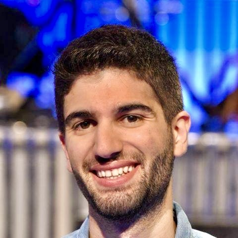

# Kevin Benac

 

  
  <!-- Profile Picture -->
  
  
  <!-- About Me Text -->
  

    <h2>About Me</h2>
    

      I am a Ph.D. candidate in Biostatistics at the University of California, Berkeley expected to graduate in May 2025. I received my Bachelor's in Mathematics and my Master's of Science in Applied Mathematics with a specialization in Probability and Statistics under the supervision of Professor Anthony C. Davison. I had the chance to be a visiting scholar in Berkeley where I worked on survival analysis applied to avalanche data under the supervision of Professor Nicholas P. Jewell.
    

    

      I am now very fortunate to be advised by Professor Peng Ding. The focus of my thesis is on causal inference and more specifically on the analysis of complex two-stage experiments without making model-based assumptions. I am also interested in Machine Learning and Survival Analysis.
    

  

## Some Work Experience

### Data Science Internships

#### Google LLC, Mountain View, CA
*Data Science Intern* 
- Developped a methodology that aimed at estimating incremental return on an ad spend (iROAS) using optimal matching and a trimmed estimator to get rid of few pairs in order to improve robustness while keeping good prediction power. Application to Sephora data.
- Data was a large matched-pairs cluster-randomized experiment and the goal was to get a causal interpretation for the iROAS.
- Filed a patent for the methodology used.

#### Google LLC, Mountain View, CA
*Data Science Intern* 
- Prediction project where goal was to estimate the conversion rate of engaged viewers in Youtube ads. This relied on a double prediction procedure that involved first predicting whether the user is actually an engaged viewers (i.e. someone who watches at least 20 sec at their computer of the ad, excluding people who skip it too fast but also people who leave their computer during the ad) and estimate the conversion rate out of these people using several covariates.

#### Georges Pompidou European Hospital, Paris, France
*Clinical Research Engineer*
- Used radiomic data to predict survival of cancer patients and provided a methodology to suggest the right treatment according to the type of cancer.

#### F.Hoffmann- La Roche AG (Roche), Basel, Switzerland

- Compared different types of prior distributions present in the literature for using historical data and improve efficiency. Application to real-data for patients suffering from Diabetic Macular Edema in order to assess the efficacy of a new treatment.
- Proposed an additional prior distribution that outperformed them.

### Teaching

## Contact

Email: benac@berkeley.edu
